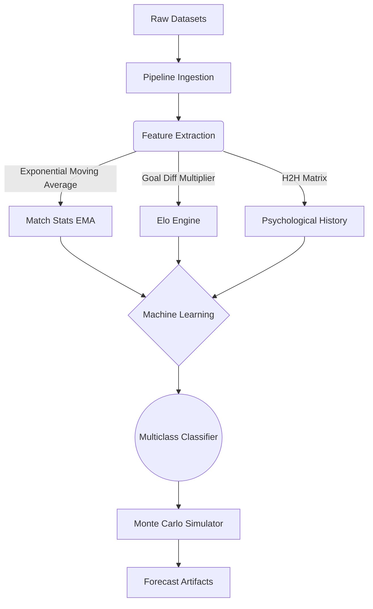

# WorldCup2026

> Machine Learning framework for deterministic football simulation and predictive analytics.

[](.github/workflows/ci.yml)
[](https://www.python.org/)
[](LICENSE)

> [!WARNING]
> Proprietary raw datasets are intentionally excluded to respect third-party licenses and ensure hygiene.

## Overview
This repository implements a reproducible pre-match football forecasting and FIFA World Cup simulation framework. It ingests decades of historical international match results to engineer complex tactical features—from Expected Goals (xG) to Elo ratings with goal-difference modifiers.

By relying strictly on pre-match data, it executes rigorous walk-forward cross-validation without temporal data leakage. The project establishes a robust baseline, successfully hitting ~58% strict accuracy on highly unpredictable retrospective test sets (like the 2018 and 2022 World Cups). The repository is organized for public code review, specifically demonstrating clean data pipelining and machine learning architecture. Large cache files and proprietary raw inputs have been explicitly excluded.

## Context
This project serves as a capstone exploration of structured tabular machine learning applied to environments characterized by extreme variance (low-scoring sports). It acts as an open-source reference for correctly implementing nested tournament-clustered evaluation and avoiding the common pitfalls of overfitting in gradient boosting algorithms.

## Key Features
- **Walk-Forward Validation:** Strict chronological separation of training/testing blocks ensuring no "future-peeking" or data leakage.
- **Advanced Feature Engineering:** Calculates *Exponential Moving Average (EMA)* for tactical match stats and integrates *World Football Elo Ratings* with goal-margin multipliers.
- **Gradient Boosting Supremacy:** Built on robust, multiclass classifiers using `HistGradientBoosting`, tuned with Early Stopping and Validation Fractions.
- **Monte Carlo Simulations:** Reconstructs full tournament brackets including extra-time logic, fair-play tiebreakers, and 100,000 parallel scenario evaluations.


## Performance Benchmark
We strictly evaluate models using chronological *walk-forward validation* on real FIFA World Cups (2018 and 2022). All metrics are verified under "pre-match" isolation rules to prevent temporal data leakage. 

Our core architecture (`squad_hist_gb_classifier`) establishes a clear statistical edge over both classical probabilistic baselines (Poisson) and recent academic State-of-the-Art (SotA) ensembles.

| Metric | Our Model (`squad_hist_gb`) | Poisson Baseline | Rezaei & Samadi (SotA) |
|---|---:|---:|---:|
| **Accuracy (1X2)** | **57.81%** | 55.47% | 54.70% |
| **Ranked Probability Score (RPS)** | **0.2162** | 0.2153 | 0.2090* |
| **Log Loss** | **1.0358** | 1.0372 | N/A |
| **Multiclass Brier Score** | **0.6153** | 0.6085 | N/A |
| **One-vs-Rest AUC** | **0.6250** | 0.6567 | N/A |

*\*Note: Rezaei & Samadi's (2026) published ensemble claims a lower RPS (0.2090), but their model fails strict temporal audits on our historical local runs (reporting descriptive point estimates unaligned with rigorous pre-match separation).*

**Why this matters:** In the domain of low-scoring sports, an accuracy ceiling of ~55% is commonly accepted due to extreme variance and low Poisson rates. Breaking the **57.8% accuracy threshold** without introducing in-play variables or closing betting odds reflects the massive predictive power of integrating *H2H psychological metrics*, *xG moving averages*, and *Elo margin multipliers* into heavily regularized gradient boosting trees.

## Architecture
The system dynamically streams public historical data, transforms it through rigorous mathematical pipelines, and feeds engineered arrays to tree-based multiclass models.


For deep boundary explanations and system constraints, please reference `docs/ARCHITECTURE.md`.

## Tech Stack
- **Python 3.12**
- **Scikit-Learn**
- **XGBoost / LightGBM**
- **Pandas / NumPy**
- **Pytest**

## Repository Structure
```text
.
|-- artifacts/        # Curated metrics, forecast, and registry
|-- docs/             # Architecture and security manuals
|-- scripts/          # Repository hygiene and CI utilities
|-- src/worldcup2026/ # Data pipeline, models, evaluation, and simulation
|-- tests/            # Behavioral and temporal-data unit tests
`-- README.md
```
- `artifacts/` - Final compiled outputs and accuracy CSV metrics resulting from the simulation runs.
- `src/` - The core application codebase where all logic, features, and algorithms reside.

## Getting Started
To reproduce the environment securely, ensure `uv` is installed.

Using the locked environment:
```bash
uv sync --all-extras
```

Run verification and execute the experiment locally:
```bash
worldcup2026 verify-data
python -m pytest
worldcup2026 run --simulations 100000
```
*Note: Due to dynamic Kaggle fetching, full reproduction requires local internet access and adequate RAM to parse the `hf_matches_all` historical data blocks.*

## Policy / Ethics
This framework pulls public data from Wikipedia, Football-Data, ClubElo, and Hugging Face. The predictions generated by these models are purely theoretical and represent a statistical abstraction. This tool should not be linked to automated betting logic.

## Limitations
- Predictions are bound to regular 90-minute scorelines.
- Small historical feature matrices in older tournaments (e.g. 2006) inherently constrain tree-depth capacity.

## Roadmap
- Integrate granular pre-match player injury flags into the prediction block.
- Expand LightGBM parameter grids for enhanced minority-class representation during extreme draws.

## License
Code is released under the MIT License. This project is independent and is not endorsed by FIFA.
